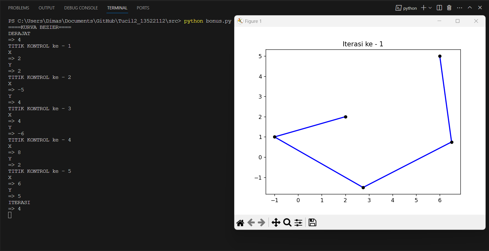

# Membangun Kurva Bézier dengan Algoritma Titik Tengah berbasis Divide and Conquer
> Tugas Kecil 2 IF2211 Strategi Algoritma
> Semester II tahun 2023/2024

## Table of Contents
* [General Info](#general-information)
* [Technologies Used](#technologies-used)
* [Features](#features)
* [Screenshots](#screenshots)
* [Setup](#setup)
* [Usage](#usage)
* [Contact](#contact)
<!-- * [License](#license) -->

## General Information

Kurva Bézier merupakan jenis kurva yang digunakan secara luas dalam berbagai bidang seperti desain grafis, animasi, dan manufaktur karena kelancarannya. Kurva ini terbentuk dari beberapa titik kontrol yang menentukan bentuk dan arahnya. Pembuatan kurva Bézier cukup sederhana, yaitu dengan menghubungkan titik kontrol tersebut dengan kurva. Kegunaan kurva Bézier sangat beragam dalam kehidupan sehari-hari, seperti dalam pembuatan pola dengan pen tool, animasi yang halus dan realistis, desain produk yang kompleks dan akurat, serta pembuatan huruf yang indah dan unik. Salah satu keunggulan utama kurva Bézier adalah kemudahan dalam mengubah dan memanipulasinya, sehingga dapat menghasilkan desain yang presisi sesuai dengan kebutuhan.

## Technologies Used
- Python
- Matplotlib: Visualization with Python

## Features
List the ready features here:
- Divide and Conquer
- Brute Force
- BONUS :)

## Screenshots

<!-- If you have screenshots you'd like to share, include them here. -->

## Setup
What are the project requirements/dependencies? Where are they listed? A requirements.txt or a Pipfile.lock file perhaps? Where is it located?

Proceed to describe how to install / setup one's local environment / get started with the project.

## Usage
How does one go about using it?
Provide various use cases and code examples here.

`write-your-code-here`

## Contact
Created by DIMAS BAGOES | 13522112